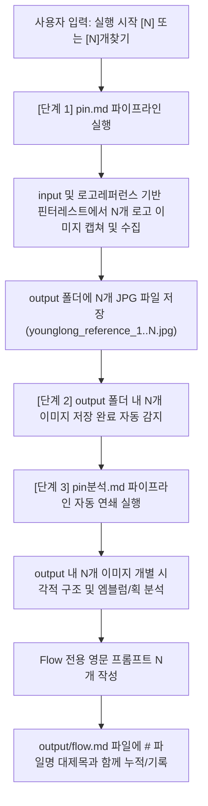

# 🤖 로고 자동화 에이전트 워크플로우 명세서 (AGENT.md)

## 1. 트리거 명령 규칙 (Trigger Commands)

* **기본 명령**: `실행 시작`, `로고 실행해`, 또는 `레퍼런스 수집 시작해`
  - **동작**: 수량 미지정 시 기본값 $N=1$ 적용. (`input` 및 `로고레퍼런스` 기반 핀터레스트 레퍼런스 1개 수집 ➡️ 1개 연쇄 분석 및 Flow 영문 프롬프트 작성)

* **수량 지정 명령**: `실행 시작 <N>`, `실행해 <N>`, 또는 `<N>개찾기` (예: `3개찾기`, `실행 시작 5`)
  - **동작**: 지정된 숫자 $N$개만큼 핀터레스트에서 레퍼런스를 수집하고, 수집 완료 후 $N$개 이미지에 대해 `pin분석.md`를 연쇄 자동 실행하여 $N$개의 Flow 영문 프롬프트를 도출 및 기록한다.
  - 예: `3개찾기` ➡️ 3개 수집 (`younglong_reference_1..3.jpg`) ➡️ 3개 연쇄 분석 ➡️ `flow.md`에 3개 프롬프트 기록.

---

## 2. 연쇄 실행 파이프라인 (Execution Pipeline Flow)

---

## 3. 세부 단계별 실행 지침 (Execution Rules)

### 📍 [단계 1] 핀터레스트 레퍼런스 수집 (`pin.md` 기반)
1. `C:\chlwlgP\로고\input\` 폴더(`로고 초안.png`, `영롱함.png`)와 `C:\chlwlgP\로고\로고레퍼런스\` 폴더(`image.png`)의 형태를 참고한다.
2. `pin.md` 및 `logo.md`에 정의된 최적 영문 검색 쿼리(`organic fluid embrace logo black and white`, `fluid liquid typography logo black and white` 등)를 활용하여 탐색한다.
3. 단색 순수 흰색 배경(`90%` 이상), 흑백 단색 선화/엠블럼/타이포그래피, 컬러/목업/그림자/3D 완전 제외 조건을 검증한다.
4. 조건에 부합하는 이미지를 $N$개 캡쳐/추출하여 `C:\chlwlgP\로고\output\` 폴더에 `younglong_reference_1.jpg`부터 `younglong_reference_N.jpg`로 저장한다.

### 📍 [단계 2] 레퍼런스 분석 및 Flow 프롬프트 생성 (`pin분석.md` 기반)
1. `output` 폴더 저장이 완료되면 즉시 `pin분석.md` 파이프라인을 자동 연쇄 실행한다.
2. 저장된 $N$개의 이미지 각각에 대해 네거티브 스페이스 포옹 구조, 멜팅 획, 글자 형태, 브랜드 부합성을 개별 분석한다.
3. **핵심 프롬프트 5대 규칙 준수**:
   - ① Flow 이미지 생성 기능 활용 프롬프트 작성
   - ② output 레퍼런스를 분석하여 Flow에 활용할 수 있는 프롬프트로 작성
   - ③ 100% 영문(English) 프롬프트 작성
   - ④ **"재실행" 명령 전까지 이미 처리된 이미지는 프롬프트 재작성 금지 (프롬프트 잠금 규칙)**
   - ⑤ `C:\chlwlgP\로고\output\flow.md` 파일에 `# <파일명>` 대제목과 함께 프롬프트 작성 및 누적 기록
