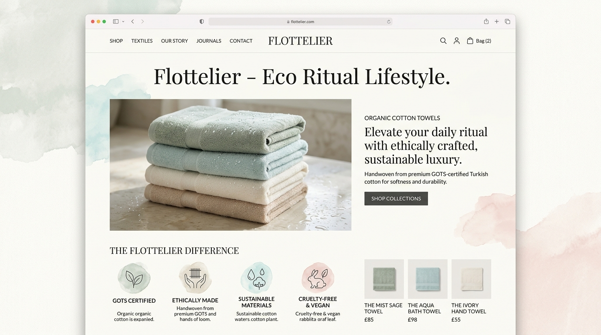
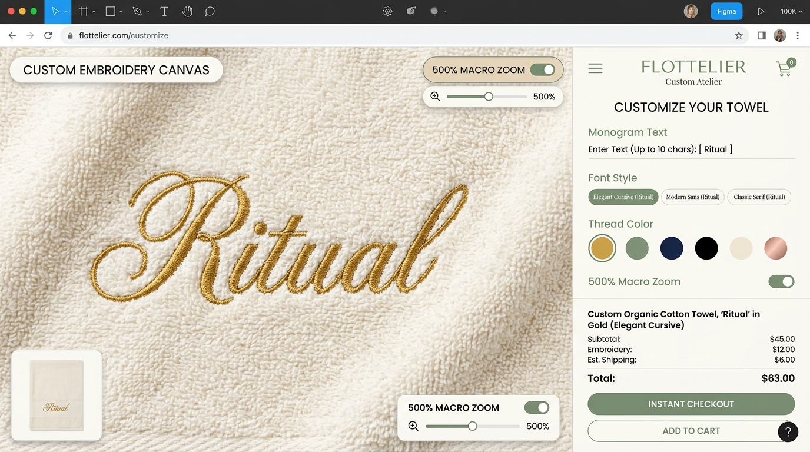

# 🎨 플로뜰리에 비주얼 디자인 & UI 쇼케이스 (Visual Design Showcase)

> **프로젝트명**: 플로뜰리에 (Flottelier) - Brand 3 소창 라이프스타일 커머스 & 에코 리추얼 플랫폼  
> **역할**: 리서치 및 600선 벤치마킹을 기반으로 시각화한 **실제 고해상도 웹 UI/UX 비주얼 디자인 명세 및 화면 뷰**  

---

## 1. 메인 랜딩 & 히어로 섹션 비주얼 (P-01 / P-02)

* **벤치마킹 레퍼런스**: `mira` (저채도 수채화 파스텔 톤) + `Aesop` (세리프 타이포 및 80% 여백) + `Izanami` (물결 인터랙션)
* **비주얼 컨셉**: 순백 아이보리 베이스 위에 은은하게 번지는 미스트 세이지 & 페일 아쿠아 수채화 워시, 정갈한 영문 세리프 로고와 4차 정련 완료 보증 뱃지.

### 🔍 시각 디자인 핵심 포인트
1. **타이포그래피 위계**:
   - Primary Header: `Cormorant Garamond` (Italic & Semi-Bold) - "Flottelier - Eco Ritual Lifestyle"
   - Body & Navigation: `Noto Sans KR` / `Pretendard` - 높은 가독성의 15px/17px 뉴트럴 그레이
2. **배경 무드보드**:
   - 자극적인 단색 배색을 배제하고 수채화 번짐(Watercolor Bleed) 텍스처로 물과 정련의 순수성 표현
3. **인증 뱃지 레이아웃**:
   - GOTS Certified, Ethically Made, Sustainable Materials, Cruelty-Free 4대 인증 아이콘 배치

---

## 2. 실시간 2D Canvas 자수 각인 아틀리에 UI (P-07 / P-09)

* **벤치마킹 레퍼런스**: `Nike By You` (실시간 커스텀 렌더러) + `Bottega Veneta` (500% 매크로 직조 줌) + `Le Labo` (장인 각인)
* **비주얼 컨셉**: 좌측에는 500% 초근접 매크로 렌즈로 소창 원단의 올 결 위에 금사(Gold Thread)로 이니셜이 수놓아지는 실시간 캔버스, 우측에는 폰트/실 색상 픽커와 즉시 결제 단가 계산기 패널.

### 🔍 커스텀 스튜디오 UI 핵심 포인트
1. **500% 매크로 줌 캔버스 (좌측)**:
   - 원단의 촘촘한 요철 질감과 실제 자수 실의 광택/음영을 사실적으로 시뮬레이션
   - 단축키 및 슬라이더로 100% ~ 500% 확대율 실시간 조절
2. **커스텀 컨트롤 패널 (우측)**:
   - **Monogram Text**: 실시간 15자 제한 입력창 및 글자수 카운터
   - **Font Style**: Elegant Cursive / Modern Sans / Classic Serif 3종 토글 알약 버튼
   - **Thread Color**: 5종 원석 실 색상(오커 골드, 세이지 그린, 네이비 딥, 차콜 블랙, 로즈 골드) 스와치
   - **실시간 가격 투명성**: 본품 가격 + 자수 각인비 + 배송비 실시간 합산 및 Instant Checkout

---

## 3. 디자인 시스템 컬러 팔레트 & 타이포 스케일

### 3.1 Color Palette
* **Deep Forest Pine**: `#1A3B34` (브랜드 메인 컬러, 신뢰감과 자연의 깊이)
* **Mist Sage Tint**: `#E8F3F1` / `#7E8D7F` (보조 악센트, 편안한 오가닉 무드)
* **Vintage Ochre Gold**: `#D97706` / `#C47A5A` (자수 실 포인트 및 강조 뱃지)
* **Pure Water Ivory**: `#FAFDFD` / `#FDFBF7` (메인 배경, 순면의 무형광 자연 톤)

### 3.2 UI 컴포넌트 셋
* **버튼 시스템**: Pill-shaped 완곡형 라운드 버튼 (`border-radius: 9999px`) + 호버 시 30px 자석 인력 효과
* **토스트 알림**: 화면 우측 상단 3초 지속 스택형 카드 알림 (`Sonner` 표준)
* **모달 레이아웃**: 블러 백드롭 (`backdrop-filter: blur(8px)`) 기반 타임슬롯 픽커 모달
