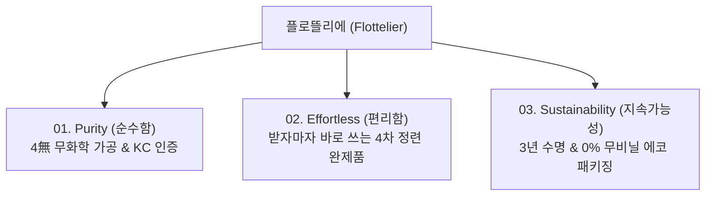

# 🌿 플로뜰리에 (Flottelier) 공식 브랜드 소개서 (Brand Introduction Master)

> **브랜드명**: 플로뜰리에 (Flottelier)  
> **어원**: *Flottant* (물에 고요히 뜨는 편안함) + *Atelier* (정성 어린 장인의 공방)  
> **슬로건**: *"시간과 손길이 만드는 고요한 에코 리추얼 (Time & Touch Eco Ritual)"*  
> **브랜드 디렉터**: 연우 (웰니스 & 라이프스타일 큐레이터)  
> **인터랙티브 웹 페이지**: [brand.html](file:///C:/chlwlgP/brand.html) | [브랜드소개.html](file:///C:/chlwlgP/브랜드소개.html)

---

## 1. 브랜드 철학 및 탄생 배경 (Brand Origin & Philosophy)

### 1.1 일상을 채우는 고요한 의식 (Eco Ritual)
매일 아침과 저녁, 세안 후 피부에 가장 먼저 닿는 섬유는 무엇일까요?
우리는 대부분 화학 섬유와 형광증백제가 섞인 테리 타월로 바쁘게 물기를 닦아냅니다. 

**플로뜰리에 (Flottelier)**는 이 평범한 1분의 순간이 나를 온전히 돌보고 호흡을 가다듬는 **'맑은 리추얼(Ritual)'**이 되기를 바라는 마음에서 시작되었습니다.

### 1.2 소창(Sochang)의 재발견과 페인포인트 극복
강화도의 맑은 물과 공기 속에서 전통 방식으로 직조되는 순면 소창은 통기성과 흡수력이 뛰어나며, 세탁할수록 부드러워지는 최고의 자연 소재입니다. 

하지만 소창을 처음 접하는 고객들에게는 큰 장벽이 있었습니다:
- **전통 소창의 불편함**: 원단에 묻은 옥수수 풀기를 제거하기 위해 집에서 냄비에 3~4번 삶고 말려야 하는 번거로움
- **플로뜰리에의 혁신**: 플로뜰리에 공방에서 전통 4단계 정련 공정을 100% 완료하여, 고객은 **"택배 상자를 여는 순간부터 뽀송하게 바로 사용"**할 수 있습니다.

---

## 2. 3대 브랜드 핵심 가치 (Core Brand Values)

1. **Purity (순수성)**: 자연 그대로의 순면, 형광·표백·염색·향료 4無 안심 공정
2. **Effortless (편안함)**: 삶고 길들이는 스트레스 없는 완제품 공급
3. **Sustainability (지속가능성)**: 3배 빠른 건조로 탄소 절감, 3년 이상 오래 쓰는 가치 소비

---

## 3. 플로뜰리에 4차 정련 전통 공정 (The 4-Step Refining Process)

| 단계 | 공정명 | 소요 시간 및 방식 | 주요 효과 및 불순물 제거율 |
| :---: | :--- | :--- | :--- |
| **Step 01** | **온수 침지 (Soaking)** | 강화도 50℃ 지하수 12시간 침지 | 원단 손상 없이 직조 시 첨가된 옥수수 풀기 불림 (45% 제거) |
| **Step 02** | **100℃ 가마솥 삶음 (Boiling)** | 전통 무쇠 가마솥 100℃ 2시간 열탕 | 목화 원사 본연의 미세 유분 및 천연 불순물 완벽 분해 (85% 제거) |
| **Step 03** | **고압 청정수 린스 (Rinsing)** | 3회 고압 회전 린스 세척 | 잔여물 및 미세 찌꺼기 0% 정밀 세척 (99.8% 제거) |
| **Step 04** | **자연 건조 & 피니싱 (Drying)** | 청정 바람 자연 건조 및 텀블 피니싱 | 뽀송한 공기층 형성, 원단 수축 안정화 및 즉시 사용 완제품 완성 |

---

## 4. 4無 안심 검증 & 공인 시험 성적서 (Safety & Proofs)

* **무형광 (No Optical Brightener)**: 피부 알레르기를 유발하는 형광증백제 불검출
* **무표백 (No Chlorine Bleach)**: 인위적인 인공 화학 백색화 공정 배제
* **무염색 (No Chemical Dye)**: 자연 목화 고유의 따스한 내추럴 아이보리 색감 유지
* **무향료 (No Synthetic Fragrance)**: 인공 화학 향료 0%
* **KC 안전 인증**: 한국의류시험연구원(KATRI) 유해물질 불검출 적합 판정
* **독일 더마테스트(Dermatest)**: 민감 피부 무자극 최고 등급 **'Excellent'** 획득

---

## 5. 소창 길들이기 타임라인 & 1:1 수축 비교 (Ritual Timeline)

소창은 사용할수록, 세탁할수록 섬유 조직 사이에 미세 공기층이 차올라 진정한 부드러움을 선사합니다:

1. **첫 만남 (Day 1)**: 4차 정련으로 삶을 필요 없이 깨끗하고 뽀송한 첫 감촉
2. **10회 세탁 후 (Day 15)**: 옥수수 조직이 자연 수축하며 도톰하고 톡톡한 엠보싱 형성
3. **30회 세탁 후 (Day 45)**: 물에 닿자마자 1초 만에 흡수하는 놀라운 수분 흡수력 발현
4. **50회 이상 (Day 90+)**: 구름을 만지듯 극상의 부드러움을 지닌 나만의 평생 리추얼 타월 완성

---

## 6. 장인정신 & 커스텀 자수 아틀리에 (Artisan Custom Atelier)

- **무라벨(Label-free) 마감**: 민감한 목과 얼굴 피부를 긁지 않도록 불필요한 직조 라벨을 제거하고 코튼 테두리로 부드럽게 마감
- **실시간 Canvas 자수 시뮬레이터**: 나만의 이니셜, 가족 이름, 감성 문구를 4종 폰트와 6종 오가닉 실 색상으로 조합하여 실시간 렌더링
- **감성 선물 패키징**: 100% 무비닐 친환경 종이 박스와 강화 순면 소창끈으로 묶어내는 정성 어린 선물 포장

---

## 7. O2O 성수 팝업스토어 & 1장 체험팩 프로그램

- **성수 팝업스토어 '시간을 짓는 공간'**: 성동구 연무장길 45에서 4차 정련 소창의 질감과 향기로운 티 리추얼을 직접 경험하는 오프라인 공간 (타임슬롯 사전예약 시 미니 와입스 증정)
- **1장 체험팩 100% 환급 시스템**: 첫 구매 부담을 덜기 위해 3,000원에 1장 먼저 사용해보고, 본품 구매 시 3,000원 전액 환급 쿠폰을 지급하는 고객 안심 프로그램

---

## 8. 관련 링크 및 연계 파일

* **브랜드 소개 인터랙티브 웹페이지**: [brand.html](file:///C:/chlwlgP/brand.html) / [브랜드소개.html](file:///C:/chlwlgP/브랜드소개.html)
* **메인 공식 웹 커머스**: [index.html](file:///C:/chlwlgP/index.html)
* **종합 사이트맵 인터랙티브 뷰어**: [사이트맵.html](file:///C:/chlwlgP/사이트맵.html)
* **화면 설계 와이어프레임 뷰어**: [가상 클라이언트 설계 결과/와이어프레임.html](file:///C:/chlwlgP/가상%20클라이언트%20설계%20결과/와이어프레임.html)
