# 🗺️ 플로뜰리에 (Flottelier) 브랜드 공식 마스터 사이트맵 (Master Sitemap v3.0)

> **프로젝트**: 프리미엄 4차 정련 소창 리추얼 커머스 & B2B 특판 플랫폼  
> **기반 페르소나**: 총 13인 통합 페르소나 (B2C: 김다꾸, 김마미, 김예민, 김트렌드, 김환경, 김선물, 김살림, 김웰니스, 김오하운, 김웨딩, 김시니어 / B2B: 김스테이, 김기업)  
> **버전**: v3.0.0 (웹 접근성 WCAG 2.1 AA & 모바일 터치 최적화 준수)  
> **인코딩**: UTF-8

---

## 1. 프로젝트 개요 및 정보 구조 (Information Architecture)

플로뜰리에(Flottelier) 마스터 사이트맵은 13대 가상 클라이언트의 핵심 요구사항인 **4차 정련 100% 완제품 보증(삶기 불필요)**, **3배 빠른 초고속 건조 & 1/3 슬림 수납**, **실시간 Canvas 자수 커스텀 시뮬레이터**, **B2B 실시간 견적서 PDF 출력 & 엑셀 일괄 배송**, **1분 웰니스 명상 오디오 & 큰 글씨/전화 주문**을 체계적인 5대 메인 영역, 16개 핵심 페이지, 5개 레이어드 모달 시스템으로 완벽히 구조화한 정보 아키텍처입니다.

```mermaid
graph TD
  ROOT["플로뜰리에 (Flottelier) 마스터 플랫폼"]

  %% 1차 메뉴 (Depth 1)
  ROOT --> BRAND["01. BRAND & RITUAL<br>(P-01 ~ P-03)"]
  ROOT --> COMMERCE["02. COMMERCE & BUNDLE<br>(P-04 ~ P-07)"]
  ROOT --> B2B["03. B2B & ENTERPRISE<br>(P-08 ~ P-10)"]
  ROOT --> MEDIA["04. EXPERIENCE & MEDIA<br>(P-11 ~ P-13)"]
  ROOT --> MY["05. MY & CONCIERGE<br>(P-14 ~ P-16)"]

  %% 2차/3차 페이지 연결
  BRAND --> P01["P-01: 메인페이지 (수채화 Canvas & 퀵 필터)"]
  BRAND --> P02["P-02: 4차 정련 스토리 (전통 공정 & 4無 인증)"]
  BRAND --> P03["P-03: 소창 길들이기 리추얼 (4단계 타임라인)"]

  COMMERCE --> P04["P-04: 전체 상품 카탈로그 (겹수·페르소나 필터)"]
  COMMERCE --> P05["P-05: 상품 상세 페이지 (자수·수축·단가 계산기)"]
  COMMERCE --> P06["P-06: 10장 수건 전체 교체 팩 (건조/수납 비교)"]
  COMMERCE --> P07["P-07: 신혼 혼수 & 선물 큐레이션 (보자기 포장)"]

  B2B --> P08["P-08: 스테이 & 호스피탈리티 센터 (어메니티/견적)"]
  B2B --> P09["P-09: 기업 ESG 비즈니스 기프트 (엑셀 일괄배송)"]
  B2B --> P10["P-10: 실시간 자동 견적서 & 세금계산서 센터"]

  MEDIA --> P11["P-11: 성수 팝업스토어 (사전예약 M-01)"]
  MEDIA --> P12["P-12: 1분 웰니스 명상 & 에디토리얼 매거진"]
  MEDIA --> P13["P-13: SNS 리얼 언박싱 & 100% 무비닐 후기"]

  MY --> P14["P-14: 장바구니 & 1초 간편결제 (N Pay/카카오)"]
  MY --> P15["P-15: 정기배송 구독 & 교체주기 알림 센터"]
  MY --> P16["P-16: 시니어 큰 글씨 & 1588 전화 주문 센터"]

  %% 모달 시스템
  P05 -.-> M03["M-03: 실시간 Canvas 자수 시뮬레이터 모달"]
  P02 -.-> M02["M-02: KC 공인 4無 시험성적서 200% 확대 모달"]
  P11 -.-> M01["M-01: 성수 팝업 1초 사전예약 모달"]
  P10 -.-> M04["M-04: 실시간 직인 견적서 PDF 1초 출력 모달"]
  P04 -.-> M05["M-05: 1장 3,000원 안심 체험팩 100% 환급 모달"]
```

---

## 2. 전역 내비게이션 시스템 (Navigation System)

* **상단 공지 띠배너 (Top Notice Banner)**:
  - `[받아서 바로 쓰는 4차 정련 완료 100% 보장]` | `[1588-0000 간편 전화주문]` | `[큰 글씨 모드 ON/OFF]`
* **글로벌 내비게이션 (GNB)**:
  - `ABOUT` (브랜드 철학 / 4차 정련 스토리 / KC 4無 인증)
  - `COLLECTION` (2·3·4겹 타월 / 10장 올체인지 팩 / 스포츠 롱타월 / 신혼 혼수)
  - `B2B 비즈니스` (스테이 어메니티 / 기업 ESG 기프트 / 실시간 견적서 PDF)
  - `RITUAL & POP-UP` (1분 명상 오디오 / 성수 팝업 예약 / 길들이기 가이드)
  - `정기구독 & 마이` (6·12개월 정기배송 / 교체 알림 / 1초 재주문)
* **로컬 내비게이션 (LNB - 스티키 탭 바)**:
  - B2C 상세: `[상품 스펙]` → `[실시간 자수 프리뷰]` → `[3배 건조 & 수납 비교]` → `[세탁기 O/X 표]` → `[리뷰 & 선물옵션]`
  - B2B 센터: `[예산별 기프트]` → `[로고 자수기]` → `[실시간 견적서 PDF]` → `[엑셀 일괄배송]` → `[세금계산서 신청]`
* **브레드크럼 (Breadcrumb Navigation)**:
  - 경로 예시: `홈 > COLLECTION > 수건 전체 교체 팩 > 10장 올 체인지 데일리 팩`
* **플로팅 퀵 액션 바 (Floating Action Bar)**:
  - `[실시간 자수 시뮬레이터 (M-03)]` | `[실시간 견적서 PDF (M-04)]` | `[1장 체험팩 100% 환급 (M-05)]` | `[1588-0000 전화 주문]`
* **푸터 (Global Footer)**:
  - 100% 무화학 정련 완제품 보증 선언, 사업자 세금계산서 센터, 대량 견적 상담, KC 안전성 성적서 등록번호, 이용약관, SNS

---

## 3. 계층별 페이지 상세 명세표 (Master Page Specifications)

| 계층 | 화면 ID | 페이지명 | 주요 목적 | 핵심 콘텐츠 및 기능 명세 | 연동 모달 / 링크 | 대응 페르소나 |
| :---: | :---: | :--- | :--- | :--- | :---: | :---: |
| **1차** | **P-01** | **메인페이지** | 브랜드 첫인상 & 핵심 가치 전달 | · 수채화 잉크 퍼짐 모션 (Canvas) · 4차 정련 완제품 뱃지 & 80% 여백 에디토리얼 · 13인 페르소나 맞춤형 퀵 진입 탭 | `M-01`, `M-02`, `M-05` | 전 고객 공통 |
| **2차** | **P-02** | **4차 정련 스토리** | 삶기 불필요성 및 위생 실증 | · 강화 소창 전통 4단계 삶음/건조 공정 · 4無(무형광·무표백·무화학·무향료) 검증 · 더마테스트 Excellent 시험성적서 | `M-02` | 김예민, 김마미, 김살림 |
| **2차** | **P-03** | **소창 길들이기 리추얼** | 수축 불안 해소 및 관리법 안내 | · 세탁 1회~90회 4단계 엠보싱 타임라인 · 세탁 전후 1:1 수축 비교 슬라이더 · 삶기 없는 세탁기/건조기 O/X 지침서 PDF | - | 김다꾸, 김예민, 김살림 |
| **1차** | **P-04** | **전체 상품 카탈로그** | 최적 상품 탐색 및 필터링 | · 2/3/4겹 겹수 탭 & 페르소나 태그 필터 · 실시간 디바운스 검색 & 자연 컬러 스와치 · 1초 장바구니 슬라이드 드로어 | `category.html`, `M-03` | 전 고객 공통 |
| **2차** | **P-05** | **상품 상세 페이지** | 스펙 확인 및 1:1 커스텀 발주 | · 500% HD 초고화질 봉제선 확대 뷰어 · 실시간 자수 각인 프리뷰 & 컬러 매칭 · 실시간 수량별 장당 단가 계산기 | `M-03`, `M-05` | 김다꾸, 김예민, 김선물 |
| **2차** | **P-06** | **10장 수건 교체 팩** | 수건 전면 교체 및 살림 최적화 | · 10장/20장 올 체인지 번들 팩 (장당 9,900원) · 테리 타월 대비 3배 빠른 건조 실험 데이터 · 욕실 상부장 1/3 슬림 수납 비포/애프터 | `M-05` | 김살림, 김오하운 |
| **2차** | **P-07** | **신혼 혼수 & 선물관** | 신혼 셋업 및 품격 있는 선물 | · 신혼 15장 홈스위트홈 풀 패키지 & 부부 자수 · 소창 보자기 전통 예단 포장 360도 뷰어 · 시댁/친정 2곳 분할 직배송 (가격표 제외) | `M-03` | 김웨딩, 김선물 |
| **1차** | **P-08** | **스테이 B2B 센터** | 감성 숙소 어메니티 납품 | · 20/50/100장 스테이 대량 번들 라인업 · 숙소 로고 Canvas 실시간 자수 시뮬레이터 · 객실 비치용 국/영문 리추얼 카드 무료 동봉 | `M-03`, `M-04` | 김스테이 |
| **1차** | **P-09** | **기업 ESG 기프트** | 기업 특판 & 대량 명절 선물 | · 3/5/10만원대 예산별 ESG 기프트 팩 · 엑셀(Excel) 1초 일괄 업로드 개별 직배송 · 친환경 플라스틱/탄소 절감 기여 리포트 | `M-04` | 김기업, 김환경 |
| **2차** | **P-10** | **견적 & 세금계산서 센터** | B2B 회계 및 결제 자동화 | · 직인 날인 공식 견적서 PDF 1초 출력기 · 사업자 세금계산서 원클릭 신청 시스템 · D-Day 납품 확약서 다운로드 | `M-04` | 김스테이, 김기업 |
| **1차** | **P-11** | **성수 팝업스토어** | 오프라인 O2O 공간 경험 | · "시간을 짓는 공간" 성수 팝업 쇼룸 소개 · 타임슬롯 사전예약 (M-01) & 카카오맵 연동 · 팝업 한정 리미티드 에디션 안내 | `M-01` | 김트렌드 |
| **2차** | **P-12** | **웰니스 & 매거진** | 마인드풀니스 오감 힐링 | · 1분 세안 호흡 명상 웹 오디오 플레이어 · 천연 시더우드/세이지 아로마 케어 가이드 · 디렉터 칼럼 & 공간 룩북 연출 팁 | - | 김웰니스 |
| **2차** | **P-13** | **SNS 언박싱 & 리뷰** | 실구매자 후기 & 친환경 검증 | · 100% 무비닐 패키징 리얼 인스타그램 리뷰 · 세탁 50회+ 실사용자 포토 후기 필터 · 뉴스레터 이메일 구독 폼 | - | 김환경, 김마미, 김다꾸 |
| **1차** | **P-14** | **장바구니 & 1초 결제** | 간편하고 투명한 주문 결제 | · 네이버페이 / 카카오페이 1초 원클릭 결제 · 100% 무비닐 친환경 에코 배송 옵션 · 2곳 이상 다중 배송지 분할 지정 | - | 전 고객 공통 |
| **2차** | **P-15** | **정기구독 & 재구매** | 교체 주기 관리 & 정기배송 | · 6개월/12개월 소창 수건 정기배송 설정 · 카카오 알림톡 교체 주기 리마인더 · 이전 자수 옵션 그대로 1-Click 재주문 | - | 김살림, 김스테이 |
| **2차** | **P-16** | **시니어 & 전화 주문관** | 디지털 취약계층 접근성 지원 | · 돋보기 폰트 큰 글씨 모드 (130% 확대) · 1588-0000 원클릭 전화 주문 / 문자 접수 · 손목 부담 50% 절감 초경량(85g) 수건 안내 | - | 김시니어 |

---

## 4. 레이어드 모달 시스템 (Modal Overlays System)

* **`M-01` [성수 팝업스토어 1초 사전예약 모달]**:
  - 방문 날짜 캘린더, 시간대별 타임슬롯(14:00 잔여 3석), 동반 인원 선택 후 카카오톡 모바일 알림톡 바코드 티켓 자동 발송.
* **`M-02` [KC 공인 안전성 인증 & 4無 성적서 200% 확대 모달]**:
  - KOTITI / KATRI 시험연구원 100% 무형광·무표백·무화학 시험성적서 고화질 200% 확대 줌 및 공인 원본 PDF 다운로드.
* **`M-03` [HTML5 Canvas 실시간 자수 각인 시뮬레이터 모달]**:
  - 한글/영문 폰트 8종, 실 색상 7종(골드/세이지/테라코타 등), 위치 선택 시 0.05초 실시간 패브릭 합성 렌더링.
* **`M-04` [실시간 직인 날인 공식 견적서 PDF 1초 출력 모달]**:
  - B2B 수량 및 옵션 선택 즉시 법인 도장이 날인된 공식 견적서 PDF를 다운로드하고 거래명세서 및 세금계산서 신청 연동.
* **`M-05` [1장 안심 체험팩 3,000원 신청 & 100% 환급 모달]**:
  - 3,000원에 먼저 1장을 체험하고, 본품 세트 구매 시 3,000원을 전액 돌려받는 100% 페이백 쿠폰 자동 발급 시스템.

---

## 5. 예외 처리 및 대체 플로우 (Exception Flows)

* **`EX-01` [검색 결과 없음 / 옵션 일시 품절]**:
  - 오타 자동 보정 검색어 추천, 유사 겹수 베스트 상품 제시, '1장 안심 체험팩 바로가기' 및 '재입고 알림톡 신청' 버튼 제공.
* **`EX-02` [404 Not Found 페이지]**:
  - 정갈한 수채화 일러스트와 함께 메인 홈, 전체 카탈로그(`category.html`), 베스트 10장 세트 퀵 링크 제공.
* **`EX-03` [대량 발주 엑셀 업로드 유효성 오류]**:
  - 우편번호 누락, 전화번호 형식 오류 행(Row)을 실시간 붉은색 하이라이트로 표시하고 인라인 즉시 수정 기능 제공.

---

## 6. 바로가기 및 관련 파일 링크

* **전체 상품 카탈로그 인터랙티브 웹 페이지**: [category.html](file:///C:/chlwlgP/category.html) | [카테고리.html](file:///C:/chlwlgP/카테고리.html)
* **공식 웹 사이트맵 뷰어**: [사이트맵.html](file:///C:/chlwlgP/사이트맵.html)
* **메인페이지 인터랙티브 구현**: [index.html](file:///C:/chlwlgP/index.html)
* **브랜드 스토리 & 4차 정련 페이지**: [brand.html](file:///C:/chlwlgP/brand.html)
* **스토리보드 통합 뷰어**: [스토리보드_전체_통합_뷰어.html](file:///C:/chlwlgP/스토리보드_전체_통합_뷰어.html)
* **가상 클라이언트 13인 분석 결과 폴더**: [클라이언트/가상클라이언트_분석결과_모음/](file:///C:/chlwlgP/클라이언트/가상클라이언트_분석결과_모음/)
