# 🗺️ 플로뜰리에 (Flottelier) - 13대 가상 클라이언트 마스터 사이트맵 (Sitemap v3.0)

> **프로젝트**: 프리미엄 4차 정련 소창 리추얼 커머스 & B2B 특판 플랫폼  
> **기반 페르소나**: 13인 가상 클라이언트 (김다꾸, 김마미, 김예민, 김트렌드, 김환경, 김선물, 김살림, 김스테이, 김웰니스, 김오하운, 김웨딩, 김기업, 김시니어)  
> **저장 폴더**: `클라이언트/가상 클라이언트 설계 결과/` 및 `가상 클라이언트 설계 결과/`  
> **인코딩**: UTF-8

---

## 1. 프로젝트 개요

본 사이트맵은 플로뜰리에 브랜드의 13대 가상 클라이언트가 요구한 핵심 구매 결정 요소인 **4차 정련 100% 완제품 보증(삶기 불필요)**, **3배 빠른 초고속 건조 & 1/3 슬림 수납**, **실시간 Canvas 자수 시뮬레이터**, **B2B 실시간 견적서 PDF 1초 출력 & 엑셀 일괄 배송**, **1분 웰니스 명상 오디오 & 큰 글씨/전화 주문** 니즈를 완벽하게 반영하여 설계된 마스터 정보 구조(IA) 문서입니다.

소창 구매의 최대 장애 요소(정련 번거로움, 수축 불안감, 겹수 선택 어려움, 자수 실패 우려, B2B 견적 지연, 디지털 주문 복잡도)를 선제적으로 해소하여 구매 전환율을 극대화합니다.

---

## 2. 설계 근거 및 핵심 사용자 목표

### 2.1 설계 근거 (페르소나 니즈 연동)
1. **정련 부담 해소 (1순위)**: 받자마자 바로 사용할 수 있는 `4차 정련 완료` 상단 뱃지 및 무화학 4無 인증 투명 공개.
2. **건조/수납 실증 (1순위)**: 테리 타월 대비 3배 빠른 건조 및 욕실 상부장 1/3 슬림 수납 비교 슬라이더 제공.
3. **커스텀 실패 방지 (1순위)**: 폰트, 실 색상(골드/실버/세이지), 위치를 실시간 렌더링하는 `Canvas 자수 시뮬레이터`.
4. **B2B 업무 자동화 (1순위)**: 도장 날인 공식 견적서 PDF 1초 출력, 엑셀 일괄 배송, 사업자 세금계산서 즉시 발행.
5. **오감 힐링 & 시니어 접근성 (2순위)**: 1분 세안 명상 오디오 가이드(QR), 큰 글씨(130%) 모드 및 1588-0000 전화 주문.
6. **선물 가치 극대화 (2순위)**: 순면 소창 보자기 예단 포장, 시댁/친정 2곳 분할 직배송(가격표 제외 보증).

---

## 3. 전역 내비게이션 구조 (Navigation System)

- **상단 띠배너 (Top Notice Banner)**: `[받아서 바로 쓰는 4차 정련 완료 100% 보장] | [1588-0000 전화주문] | [큰 글씨 모드]`
- **글로벌 내비게이션 (GNB)**:
  - `ABOUT` (브랜드 철학 / 4차 정련 공정 / KC 4無 인증)
  - `COLLECTION` (2·3·4겹 타월 / 10장 올체인지 팩 / 스포츠 롱타월 / 신혼 혼수)
  - `B2B 비즈니스` (스테이 어메니티 / 기업 ESG 기프트 / 실시간 견적서 PDF)
  - `RITUAL & POP-UP` (1분 명상 오디오 / 성수 팝업 예약 / 길들이기 가이드)
  - `정기구독 & 마이` (6·12개월 정기배송 / 교체 알림 / 1초 재주문)
- **로컬 내비게이션 (LNB - 상세 스티키 탭)**:
  - B2C 상세: `[상품 스펙]` ➔ `[실시간 자수 프리뷰]` ➔ `[3배 건조 & 수납 비교]` ➔ `[세탁기 O/X 표]` ➔ `[리뷰 & 선물옵션]`
  - B2B 센터: `[예산별 기프트]` ➔ `[로고 자수기]` ➔ `[실시간 견적서 PDF]` ➔ `[엑셀 일괄배송]` ➔ `[세금계산서 신청]`
- **브레드크럼 (Breadcrumb)**: `홈 > COLLECTION > 수건 전체 교체 팩 > 10장 올 체인지 데일리 팩`
- **플로팅 퀵바 (Floating Bar)**: `[실시간 자수 시뮬레이터 (M-03)]`, `[실시간 견적서 PDF (M-04)]`, `[1장 체험팩 100% 환급 (M-05)]`, `[1588-0000 전화 주문]`
- **푸터 (Footer)**: 100% 무화학 정련 공정 선언, CS센터, 자수 제작(D+2) 배송 안내, 세탁 가이드 PDF 다운로드

---

## 4. 계층형 사이트맵 (Hierarchical Sitemap)

```text
[플로뜰리에 (Flottelier) - Master Edition v3.0]
├── 0. 공통 / 회원 공통 영역 (Global Shared)
│   ├── GNB 상단 띠배너 (4차 정련 완료 & 큰 글씨 전환 & 전화주문)
│   ├── GNB 내비게이션 & 디바운스 실시간 검색창
│   ├── 플로팅 퀵바 (자수 프리뷰 / 견적서 PDF / 체험팩 신청 / 전화주문)
│   └── 푸터 & 4無 안전성 성적서 & 세탁 가이드 PDF 다운로드
│
├── 1. 1차 깊이: BRAND & RITUAL (브랜드 & 리추얼)
│   ├── P-01. 메인페이지 (수채화 Canvas & 13인 페르소나 퀵 탭) [공통]
│   ├── P-02. 4차 정련 스토리 (전통 공정 & 4無 안심 검증) [공통]
│   └── P-03. 소창 길들이기 리추얼 (4단계 타임라인 & 수축 가이드) [공통]
│
├── 2. 1차 깊이: COMMERCE & BUNDLE (쇼핑 & 번들)
│   ├── P-04. 전체 상품 카탈로그 (2/3/4겹 탭 & 페르소나 필터) [공통]
│   ├── P-05. 상품 상세 페이지 (500% HD 확대 & 자수 프리뷰) [공통]
│   ├── P-06. 10장 수건 전체 교체 팩 (3배 건조 & 1/3 슬림 수납) [공통]
│   └── P-07. 신혼 혼수 & 선물 큐레이션 (소창 보자기 예단 & 2곳 분할배송) [공통]
│
├── 3. 1차 깊이: B2B & ENTERPRISE (스테이 & 기업 특판)
│   ├── P-08. 스테이 & 호스피탈리티 센터 (객실 번들 & 국영문 리추얼 카드) [사업자]
│   ├── P-09. 기업 ESG 비즈니스 기프트 (예산별 팩 & 엑셀 일괄배송) [사업자]
│   └── P-10. 실시간 자동 견적서 & 세금계산서 센터 (직인 PDF 출력) [사업자]
│
├── 4. 1차 깊이: EXPERIENCE & MEDIA (팝업 & 웰니스 미디어)
│   ├── P-11. 성수 팝업스토어 안내 (타임슬롯 사전예약 M-01) [공통]
│   ├── P-12. 1분 웰니스 명상 & 에디토리얼 매거진 (오디오 플레이어) [공통]
│   └── P-13. SNS 언박싱 & 100% 무비닐 후기 (포토 갤러리) [공통]
│
├── 5. 1차 깊이: MY & CONCIERGE (주문 & 고객 지원)
│   ├── P-14. 장바구니 & 1초 간편결제 (N Pay / 카카오페이 / 무비닐 배송) [공통]
│   ├── P-15. 정기배송 구독 & 교체주기 알림 센터 (6/12개월 설정) [회원]
│   └── P-16. 시니어 큰 글씨 & 1588 전화 주문관 (초경량 85g 안내) [시니어]
│
└── 6. 예외 & 레이어드 모달 시스템 (Modals & Exceptions)
    ├── M-01. 성수 팝업스토어 1초 사전예약 모달 [공통/인터랙션]
    ├── M-02. KC 4無 안전성 인증서 200% 확대 모달 [공통/인터랙션]
    ├── M-03. Canvas 실시간 자수 각인 시뮬레이터 모달 [공통/인터랙션]
    ├── M-04. 실시간 직인 날인 공식 견적서 PDF 1초 출력 모달 [사업자/인터랙션]
    ├── M-05. 1장 안심 체험팩 3,000원 신청 & 100% 환급 모달 [공통/인터랙션]
    ├── EX-01. 검색 결과 없음 / 옵션 품절 대안 페이지 [가정]
    ├── EX-02. 404 Not Found 안내 페이지 [가정]
    └── EX-03. 엑셀 대량 배송 오류 검증 피드백 화면 [가정]
```

---

## 5. 페이지별 상세 명세표 (Master Page Specifications)

| 깊이 | 화면 ID | 페이지명 | 목적 | 핵심 콘텐츠 | 주요 기능 | 연결 페이지 | 대응 페르소나 |
| :---: | :---: | :--- | :--- | :--- | :--- | :--- | :---: |
| 1차 | **P-01** | **메인페이지** | 브랜드 첫인상 및 핵심 가치 전달 | • 4차 정련 완제품 뱃지<br>• 수채화 잉크 퍼짐 모션<br>• 13인 페르소나 퀵 탭 | • 겹수별 원클릭 필터<br>• 자수 시뮬레이터 진입<br>• 1장 체험팩 신청 링크 | P-02, P-04, P-05, P-06, P-08, P-11 | 전 고객 공통 |
| 2차 | **P-02** | **4차 정련 스토리** | 정련 불필요성 및 4無 안전성 증명 | • 4단계 삶기/건조 전통 공정<br>• KOTITI/KATRI 시험성적서<br>• 더마테스트 Excellent | • 시험성적서 확대 (`M-02`)<br>• 공정 단계별 슬라이더 | P-01, P-03, P-05 | 김예민, 김마미, 김살림 |
| 2차 | **P-03** | **소창 길들이기 리추얼** | 세탁 후 수축 불안 해소 및 관리법 제공 | • 4단계 섬유 엠보싱 타임라인<br>• 세탁 전후 1:1 수축 비교표<br>• 삶기 없는 세탁기 O/X 표 | • 세탁 전후 비교 Slider<br>• 세탁 가이드 PDF 다운로드 | P-04, P-05, P-06 | 김다꾸, 김예민, 김살림 |
| 1차 | **P-04** | **전체 상품 카탈로그** | 겹수/용도/세트별 최적 상품 탐색 | • 2/3/4겹 타월 및 번들 목록<br>• 자연 컬러 스와치 팔레트<br>• 페르소나 태그 필터 | • 겹수/페르소나 필터링<br>• 실시간 장당 단가 표시<br>• 1초 장바구니 드로어 | P-05, P-06, P-07, P-14 | 전 고객 공통 |
| 2차 | **P-05** | **상품 상세 페이지** | 상세 스펙 확인 및 커스텀 옵션 선택 | • 500% HD 확대 뷰어<br>• 실시간 자수 합성 시뮬레이터<br>• 소창 보자기 포장 갤러리 | • 실시간 Canvas 자수 프리뷰<br>• 낱장/세트 단가 계산기<br>• N Pay 1초 결제 | P-04, P-07, P-14, M-03, M-05 | 김다꾸, 김예민, 김선물 |
| 2차 | **P-06** | **10장 수건 전체 교체 팩** | 수건 전면 교체 및 살림 최적화 | • 10장/20장 올체인지 번들 팩<br>• 3배 빠른 건조 실험 데이터<br>• 상부장 1/3 슬림 수납 비교 | • 수량별 장당 단가 계산기<br>• 수납 비교 슬라이더 | P-04, P-05, P-14, P-15 | 김살림, 김오하운 |
| 2차 | **P-07** | **신혼 혼수 & 선물관** | 신혼 셋업 및 품격 있는 선물 | • 신혼 15장 홈스위트홈 풀세트<br>• 순면 소창 보자기 예단 포장<br>• 시댁/친정 2곳 분할 배송 | • 웨딩 자수 시뮬레이터<br>• D-Day 배송 계산기<br>• 2곳 분할 주소록 폼 | P-04, P-05, P-14, M-03 | 김웨딩, 김선물 |
| 1차 | **P-08** | **스테이 B2B 센터** | 감성 숙소 어메니티 대량 납품 | • 20/50/100장 객실 번들 팩<br>• 국/영문 리추얼 카드 동봉<br>• 100회 세탁 내구성 성적서 | • 숙소 로고 자수 시뮬레이터<br>• 호스트 샘플 키트 신청<br>• 실시간 견적서 PDF 다운로드 | P-05, P-10, M-03, M-04 | 김스테이 |
| 1차 | **P-09** | **기업 ESG 기프트** | 기업 특판 & 대량 명절 선물 | • 3/5/10만원대 ESG 기프트 팩<br>• 탄소/플라스틱 절감 리포트<br>• CEO 감사 카드 & 맞춤 슬리브 | • 엑셀 1초 일괄 업로드 폼<br>• 기업 로고 금/은사 자수기<br>• D-Day 납품 확약서 | P-10, M-04 | 김기업, 김환경 |
| 2차 | **P-10** | **견적 & 세금계산서 센터** | B2B 회계 및 결제 자동화 | • 법인 직인 날인 견적서 양식<br>• 사업자등록증 확인 시스템<br>• 결제 증빙 및 거래명세서 | • 직인 견적서 PDF 1초 출력<br>• 세금계산서 원클릭 신청 | P-08, P-09, P-14, M-04 | 김스테이, 김기업 |
| 1차 | **P-11** | **성수 팝업스토어** | 오프라인 감성 체험 및 예약 | • "시간을 짓는 공간" 팝업 안내<br>• 카카오맵 길찾기 및 타임테이블 | • 타임슬롯 1초 사전예약<br>• 알림톡 모바일 바코드 발송 | P-01, P-12, M-01 | 김트렌드 |
| 2차 | **P-12** | **웰니스 & 매거진** | 마인드풀니스 오감 힐링 | • 1분 호흡 명상 오디오 음원<br>• 터치 프리 1초 흡수 세안법<br>• 디렉터 칼럼 & 공간 룩북 | • 1분 명상 웹 오디오 플레이어<br>• 나만의 리추얼 매칭 퀴즈 | P-04, P-05, P-13 | 김웰니스 |
| 2차 | **P-13** | **SNS 언박싱 & 리뷰** | 실구매자 세탁 후기 및 언박싱 확인 | • 100% 무비닐 패키징 언박싱<br>• 세탁 50회+ 실사용 리뷰<br>• 인스타그램 포토 피드 | • 세탁 횟수별 후기 필터<br>• 뉴스레터 이메일 구독 폼 | P-04, P-05 | 김환경, 김마미, 김다꾸 |
| 1차 | **P-14** | **장바구니 & 결제** | 투명한 금액 확인 및 간편 주문 | • 품목 및 자수/각인 옵션 내역<br>• 무비닐 친환경 에코 배송<br>• 다중 배송지 분할 지정 | • N Pay / 카카오페이 1초 결제<br>• 배송지 분할 입력<br>• 쿠폰/적립금 적용 | P-05, P-15 | 전 고객 공통 |
| 2차 | **P-15** | **정기구독 & 재구매** | 주문 조회 및 정기배송 관리 | • 6/12개월 정기구독 설정<br>• 소창 교체 주기 알림톡<br>• 최근 자수 템플릿 1초 재주문 | • 정기배송 주기 변경/해지<br>• 원클릭 동일 옵션 재주문 | P-04, P-14 | 김살림, 김스테이 |
| 2차 | **P-16** | **시니어 & 전화 주문관** | 디지털 취약계층 접근성 지원 | • 손목 안심 초경량(85g) 안내<br>• 큰 글씨 일러스트 그림 세탁표<br>• 손주 안심 4無 성적서 | • 큰 글씨 모드(130%) 스위치<br>• 1588-0000 간편 전화 주문<br>• 한글 붓글씨 자수기 | P-04, P-14 | 김시니어 |
| 예외 | **EX-01** | **검색 결과 없음 / 품절** | 검색 실패 및 품절 시 대안 제시 | • 추천 검색어 및 인기 키워드<br>• 유사 겹수 베스트 상품 추천 | • 1장 체험팩 바로가기<br>• 재입고 알림톡 신청 | P-04, M-05 | 이탈 방지 |
| 예외 | **EX-02** | **404 Not Found** | 잘못된 경로 접근 시 복구 경로 | • 감성 수채화 일러스트 안내 문구 | • 메인 홈 바로가기<br>• 베스트 10장 세트 이동 | P-01, P-04 | UX 연속성 유지 |
| 예외 | **EX-03** | **엑셀 대량 배송 오류 검증** | 대량 배송지 주소 오류 피드백 | • 우편번호/연락처 오류 행 표시 | • 인라인 실시간 주소 수정<br>• 템플릿 재업로드 | P-09, P-10 | B2B 업무 완결 |

---

## 6. Mermaid 사이트맵 플로우차트 (Flowchart Architecture)

```mermaid
flowchart TD
  %% 루트
  ROOT(["플로뜰리에 (Flottelier) Master Edition"])

  %% 1차 메뉴 (GNB)
  ROOT --> BRAND["01. BRAND & RITUAL"]
  ROOT --> SHOP["02. COMMERCE & BUNDLE"]
  ROOT --> B2B["03. B2B & ENTERPRISE"]
  ROOT --> MEDIA["04. EXPERIENCE & MEDIA"]
  ROOT --> MY["05. MY & CONCIERGE"]

  %% 2차/3차 페이지
  BRAND --> P01["P-01 메인페이지"]
  BRAND --> P02["P-02 4차 정련 스토리"]
  BRAND --> P03["P-03 소창 길들이기 리추얼"]

  SHOP --> P04["P-04 전체 상품 카탈로그"]
  SHOP --> P05["P-05 상품 상세 페이지"]
  SHOP --> P06["P-06 10장 수건 교체 팩"]
  SHOP --> P07["P-07 신혼 혼수 & 선물관"]

  B2B --> P08["P-08 스테이 B2B 센터"]
  B2B --> P09["P-09 기업 ESG 기프트"]
  B2B --> P10["P-10 견적 & 세금계산서 센터"]

  MEDIA --> P11["P-11 성수 팝업스토어"]
  MEDIA --> P12["P-12 웰니스 & 매거진"]
  MEDIA --> P13["P-13 SNS 언박싱 & 리뷰"]

  MY --> P14["P-14 장바구니 & 1초 결제"]
  MY --> P15["P-15 정기구독 & 재구매"]
  MY --> P16["P-16 시니어 & 전화 주문관"]

  %% 레이어드 모달 연동
  P11 -.-> M01["M-01 성수 팝업 사전예약 모달"]
  P02 -.-> M02["M-02 KC 4無 인증서 확대 모달"]
  P05 -.-> M03["M-03 Canvas 자수 시뮬레이터 모달"]
  P08 -.-> M03
  P10 -.-> M04["M-04 실시간 견적서 PDF 출력 모달"]
  P09 -.-> M04
  P04 -.-> M05["M-05 1장 체험팩 100% 환급 모달"]
  P06 -.-> M05

  %% 예외 페이지 연결 [가정]
  P04 -.-> EX01["EX-01 검색 없음/품절 (가정)"]
  ROOT -.-> EX02["EX-02 404 Not Found (가정)"]
  P09 -.-> EX03["EX-03 엑셀 배송 오류 검증 (가정)"]

  %% 스타일 클래스
  classDef primary fill:#E8F3F1,stroke:#4A7C72,stroke-width:2px,color:#1A3B34;
  classDef b2b fill:#EBF3FA,stroke:#2B6CB0,stroke-width:2px,color:#1A365D;
  classDef modal fill:#FFF6ED,stroke:#D97706,stroke-width:1.5px,color:#92400E;
  classDef exception fill:#FEE2E2,stroke:#EF4444,stroke-width:1.5px,stroke-dasharray: 4 4,color:#991B1B;
  
  class ROOT,BRAND,SHOP,MEDIA,MY,P01,P02,P03,P04,P05,P06,P07,P11,P12,P13,P14,P15,P16 primary;
  class B2B,P08,P09,P10 b2b;
  class M01,M02,M03,M04,M05 modal;
  class EX01,EX02,EX03 exception;
```


