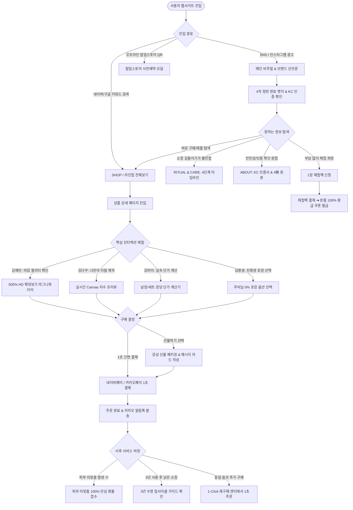
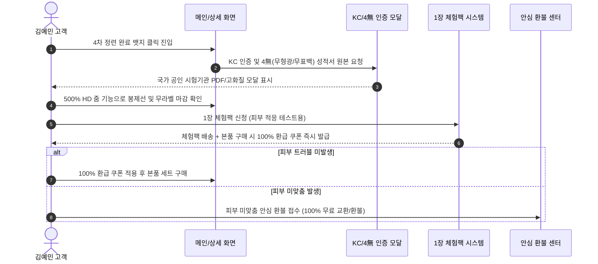
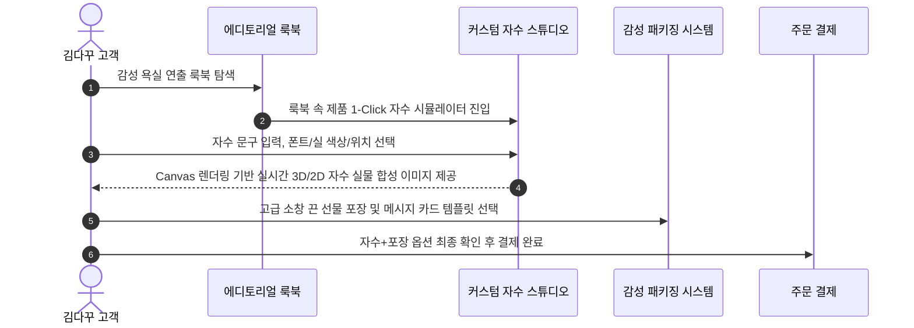
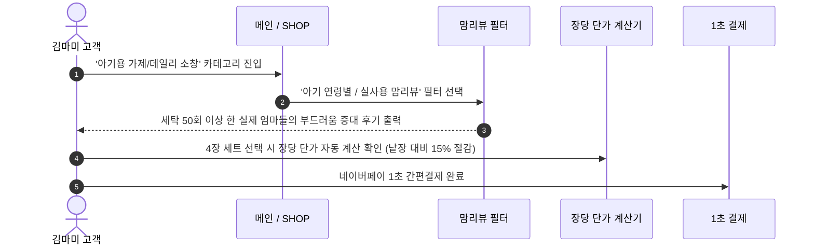
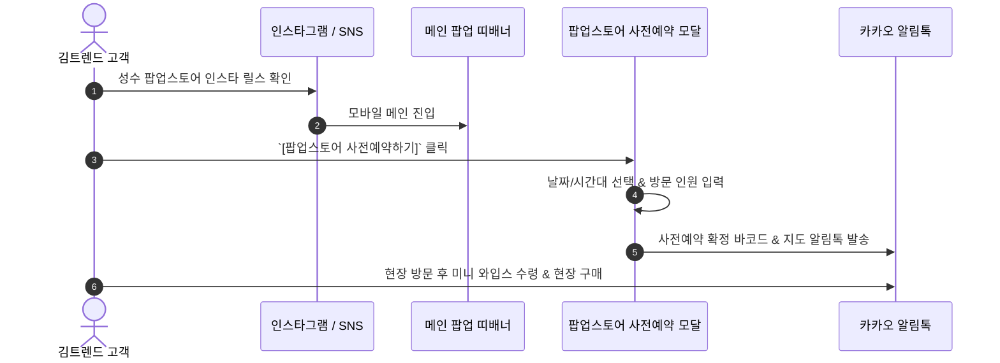
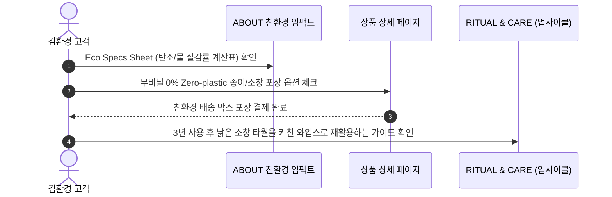

# [2. 서비스 흐름도 제작] 플로뜰리에 (Flottelier) 서비스 흐름도 (Service Flowchart)

> **프로젝트명**: 플로뜰리에 (Flottelier) - 4차 정련 완료 소창 라이프스타일 커머스 & 에코 리추얼 플랫폼  
> **기반 문서**: `[1. 사이트맵 제작]` 문서 (`01_사이트맵_제작.md`) 및 5인 가상 클라이언트 분석 결과  
> **목적**: 사용자 진입부터 상품 탐색, 맞춤 옵션 선택, 결제, 배송, 사후 케어까지의 종합 서비스 흐름도(Service Flowchart) 및 페르소나별 시나리오 정의

---

## 1. 전체 사용자 통합 서비스 흐름도 (Overall Service Flow)

Below is the complete user flow from initial acquisition to after-sales care:

---

## 2. 페르소나 5인별 맞춤 서비스 흐름도

### 2.1 Flow A: 김예민 (초민감 피부 & 안전 검증 유저)

---

### 2.2 Flow B: 김다꾸 (감성 커스텀 & 선물 구매 유저)

---

### 2.3 Flow C: 김마미 (가성비 & 아기 위생 유저)

---

### 2.4 Flow D: 김트렌드 (감성 O2O & 팝업스토어 유저)

---

### 2.5 Flow E: 김환경 (친환경 & 지속가능성 유저)

---

## 3. 핵심 기능별 비즈니스 로직 & 예외 처리

### 3.1 1장 체험팩 100% 환급 쿠폰 발급 로직
1. **조건**: 동일 회원 계정당 최초 1회에 한함.
2. **프로세스**:
   - 체험팩 결제 완료 즉시 마이페이지 및 알림톡으로 `[본품 100% 환급 쿠폰]` 자동 발급.
   - 본품 구매 시 쿠폰 적용 ➔ 체험팩 결제 금액 전액 할인 차감.
3. **예외 처리**:
   - 비회원 구매 시 회원가입 전환 안내 팝업 표시.

### 3.2 피부 미맞춤 안심 환불 접수 로직
1. **조건**: 제품 수령 후 14일 이내, 1장 체험 후 피부 미맞춤 발생 시.
2. **프로세스**:
   - `COMMUNITY > 안심 환불 센터`에서 간편 사유 입력 접수.
   - 택배사 자동 수거 지시 및 제품 수거 후 100% 전액 환불.

### 3.3 오프라인 팝업스토어 사전 예약 로직
1. **조건**: 타임슬롯당 최대 15명 정원 제한.
2. **프로세스**:
   - 실시간 잔여 인원 확인 ➔ 예약 완료 시 예약 바코드 생성 ➔ 카카오 알림톡 발송.
   - 취소 발생 시 대기 고객에게 수동/자동 알림톡 전송.

---

## 4. 결론 및 다음 단계

본 **[2. 서비스 흐름도 제작]** 문서는 전체 사용자 통합 흐름뿐만 아니라 5인 페르소나 각각의 니즈와 인터랙션 요구사항을 명확하게 도시화하였습니다.

다음 단계로 본 서비스 흐름도를 바탕으로 한 **[3. 화면 설계서 제작]** (`03_화면_설계서.md`) 생성을 진행합니다.
